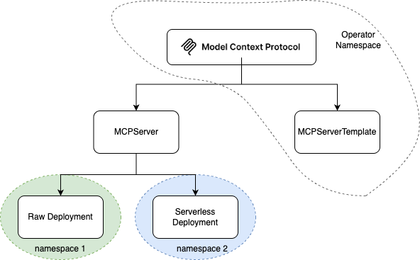

#  MCP Operator

**MCP Operator** (Model Context Protocol Operator) is a generic Kubernetes Operator that enables the deployment of MCP Server instances on **OpenShift** environments with ease and reusability. It introduces two custom resources: `MCPServerTemplate` and `MCPServer` to streamline and standardize deployments.

---

## 🚀 Features

- ✅ Declarative deployment of MCP Servers
- 🔁 Reusable templates for consistent configurations
- 🔐 Support for image pull secrets and service accounts
- ⚙️ Familiar Kubernetes-style `spec` structure for quick adoption

---

## 📦 Custom Resources

### 🧩 MCPServerTemplate

---

`MCPServerTemplate` acts as a reusable deployment configuration, similar in structure to Kubernetes `Deployment` resources. It helps users avoid repetitive configurations when deploying multiple MCP Server instances. 
- **Acts as a reusable deployment template** for MCP Servers.
- Must be created in the **same namespace where the MCP Operator is installed**.
- Can be **referenced by any `MCPServer` across all namespaces**, making it a shared deployment blueprint.

It's allowing users to define:

- Containers

- Labels and Annotations

- Resource Requests and Limits

- ImagePullSecrets

This helps avoid repetitive configurations and simplifies server instantiation.

#### Example

```yaml
apiVersion: mcp.opendatahub.io/v1alpha1
kind: MCPServerTemplate
metadata:
  annotations:
    openshift.io/display-name: 'MCP Server Template'
  name: mcpserver-template
spec:
  containers:
    - name: mcpserver-container
      image: $(mcp-server-image)
      ports:
        - containerPort: 8080
          protocol: TCP
      terminationMessagePath: /dev/termination-log
      terminationMessagePolicy: File
      imagePullPolicy: IfNotPresent
      resources:
        requests:
          memory: "128Mi"
          cpu: "250m"
        limits:
          memory: "512Mi"
          cpu: "500m"
```          

### 🧩 MCPServer

---

`MCPServer` is the primary resource that triggers the actual deployment of an MCP Server. It references an existing `MCPServerTemplate` through an annotation and merges runtime settings from both the template and the server spec.

You can override or augment the template by defining:

- A single container

- ServiceAccountName

- ImagePullSecrets

#### Example

Raw Deployment Mode
```yaml
apiVersion: mcp.opendatahub.io/v1alpha1
kind: MCPServer
metadata:
  labels:
    app.kubernetes.io/name: mcp-operator
  annotations:
    mcp.opendatahub.io/deploymentmode: RawDeployment
    mcp.opendatahub.io/visibility: hidden
    mcp.opendatahub.io/mcpservertemplate: mcp-operator-mcpserver-template
  name: mcp-workday
spec:
  container:
    name: mcpserver-container
    image: quay.io/vajain/mcp-workday:6.0
```
Serverless Deployment Mode

```yaml
apiVersion: mcp.opendatahub.io/v1alpha1
kind: MCPServer
metadata:
  labels:
    app.kubernetes.io/name: mcp-operator
  annotations:
    mcp.opendatahub.io/deploymentmode: Serverless
    mcp.opendatahub.io/visibility: exposed
    mcp.opendatahub.io/mcpservertemplate: mcp-operator-mcpserver-template
    serving.knative.openshift.io/enablePassthrough: 'true'
    sidecar.istio.io/inject: 'true'
    sidecar.istio.io/rewriteAppHTTPProbers: 'true'
  name: mcp-linkedin
spec:
  container:
    name: mcpserver-container
    image: quay.io/vajain/mcp-linkedin:6.0
```

---

## 🏗 High-Level Architecture

MCP Operator supports flexible deployment strategies and integrates tightly with OpenShift and its AI ecosystem. Here’s how it works:



### 📦 RawDeployment Mode
A standard Deployment, Service, and optionally a Route are created.

Use the `mcp.opendatahub.io/visibility` annotation to control Route creation:

- exposed → Route is created.

- hidden or unset → No Route is created.

### ⚡ Serverless Mode
- Integrates with OpenShift AI Operator ecosystem.

- Deploys MCP Server as a Knative Service.

- Leverages existing Service Mesh and Serverless Operator resources.

- All traffic (inbound and outbound) is managed via Istio.

---

## License

Copyright 2025.

Licensed under the Apache License, Version 2.0 (the "License");
you may not use this file except in compliance with the License.
You may obtain a copy of the License at

    http://www.apache.org/licenses/LICENSE-2.0

Unless required by applicable law or agreed to in writing, software
distributed under the License is distributed on an "AS IS" BASIS,
WITHOUT WARRANTIES OR CONDITIONS OF ANY KIND, either express or implied.
See the License for the specific language governing permissions and
limitations under the License.

